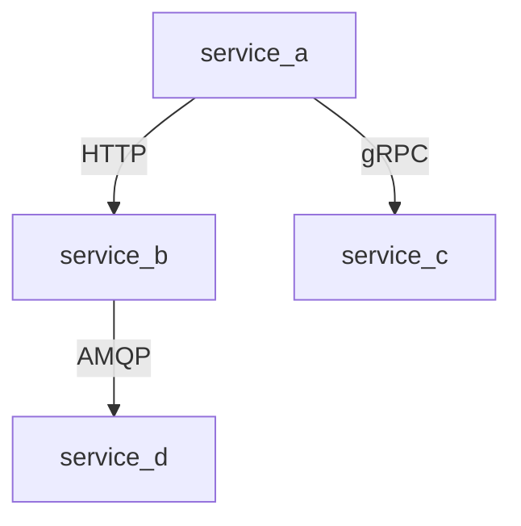

# Service Map Output Template

> Service-to-service dependencies, protocols, resilience patterns. The KB Generator reads this
> template and fills it. Delete the `> TEMPLATE` blocks when generating.

---

```markdown
# Service Map

> Generated {date} at commit {short_sha}. Freshness: {score}. Every claim cites real files.
> Load priority: cold. Load when touching: docker-compose, k8s, deploy, clients.

## Overview

> TEMPLATE: One-line summary.

{N} services, {M} inter-service dependencies. Orchestration: {Docker Compose / Kubernetes / etc.} (`{config path}`).

## Services

> TEMPLATE: One row per service/container. Include internal services only — not external
> third-party APIs (those go in api-registry if relevant).

| Service | Path | Port | Purpose |
|---------|------|------|---------|
| `{service-name}` | `{source directory}` | {port} | {one sentence} |

## Dependencies

> TEMPLATE: One row per inter-service dependency. Source calls target.
> Client file is the code that makes the call.

| Source | Target | Protocol | Client File | Retry | Circuit Breaker |
|--------|--------|----------|-------------|-------|-----------------|
| `{service-a}` | `{service-b}` | {HTTP / gRPC / AMQP / Redis pub/sub} | `{path/to/client}` | {3x / none} | {threshold or none} |

## Service Topology

> TEMPLATE: Mermaid diagram showing service dependencies.
> Services are nodes. Dependencies are directed edges labeled with protocol.



## Message Queues / Event Buses

> TEMPLATE: If services communicate via message queues or event buses, document them here.
> Skip this section if no async messaging is detected.

| Queue/Topic | Producer | Consumer | Message Type | Config |
|-------------|----------|----------|-------------|--------|
| `{queue-name}` | `{service}` | `{service}` | `{MessageDto}` | `{config path}` |

## Health Checks

> TEMPLATE: Health check endpoints per service, if defined.
> Skip this section if no health checks are detected.

| Service | Health Endpoint | Config |
|---------|----------------|--------|
| `{service}` | `{GET /health}` | `{path}` |

## See Also

- [API Registry]({NN}-api-registry.md) — endpoint details for each service
- [Env Config]({NN}-env-config.md) — per-service environment variables (if generated)
- [Database Schema]({NN}-database-schema.md) — which services own which tables (if generated)
```
